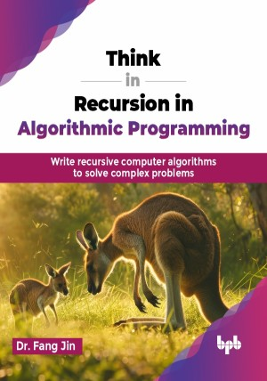

# Think in Recursion in Algorithmic Programming

Write recursive computer algorithms to solve complex problems.

This is the repository for [Think in Recursion in Algorithmic Programming
](https://bpbonline.com/products/think-in-recursion-in-algorithmic-programming?variant=44036112122056),published by BPB Publications.

## About the Book
Recursion, a fundamental programming concept, empowers developers to solve complex problems elegantly and efficiently. However, excelling at recursion can be challenging due to its counterintuitive nature. This book is your comprehensive guide to understanding and applying recursion in your programming journey.

This book is a complete guide to understanding recursion, starting from the basics and moving to more complex topics. It explains what recursion is and how it is different from iteration, using easy examples like calculating the factorial of a number, raising numbers to a power, and the Fibonacci sequence. The book then goes into more advanced topics like backtracking, dynamic programming, and tree traversal. It shows how to break big problems into smaller, manageable parts and how to make solutions faster with memoization. Real-world examples like the knapsack problem and finding the shortest path in a network are included.

By the end of this book, readers will have a strong grasp of recursion, understanding not just how it works but also its practical applications. They will learn about Big O notation, which is crucial for evaluating the performance and efficiency of algorithms. Additionally, they will become familiar with function stacks, which play a vital role in understanding how recursive calls are managed in memory. 

## What You Will Learn
• Understand the basics of recursive algorithms and their nature.

• Learn to plan, write, and stop recursion with boundary conditions.

• Analyze recursive algorithm efficiency using Big O notation.

• Differentiate between classical recursion and backtracking techniques.

• Optimize recursion with memorization to improve performance.
